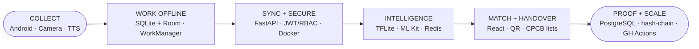

# ♻️ KABADIWALA CONNECT
### Bringing India's informal e-waste collectors into the formal recycling chain

`Smart India Hackathon 2026 · Problem Statement 26229 · Ministry of Mines / JNARDDC · Category: Software · Theme: Clean & Green Technology`

> **A vernacular, offline-first mobile bridge that lets an informal scrap collector discover a fair price, match with a verified authorized recycler, hand over material with digital proof, get paid, and build a financial identity — while generating the first-mile dataset India's EPR regime has never had.**

---

## ⚡ The problem in 30 seconds

| Fact | Source |
|---|---|
| India generated **13.98 lakh tonnes** of e-waste in FY 2024-25 (12.54 lakh t in FY 2023-24) | [PIB, Rajya Sabha reply, 24-Jul-2025](https://www.pib.gov.in/PressReleasePage.aspx?PRID=2147876) |
| **~90 %** of that volume physically moves through informal collectors | [CSE 2020](https://www.cseindia.org/content/downloadreports/10593) |
| Registered recyclers hold **≈22.08 lakh t/yr** authorised capacity — feedstock-starved | MoEFCC Feb-2025, via [The India Forum fieldwork](https://www.theindiaforum.in/amp/public-policy/paper-compliance-physical-reality-e-waste-management) |
| **0** public price datasets exist for Indian e-waste fractions | this project's research audit (§9, §23.5) |
| EPR monetises **certificates, not physical flow** — ghost-plant fraud documented | [Newslaundry 2025 via India Forum](https://www.theindiaforum.in/amp/public-policy/paper-compliance-physical-reality-e-waste-management) |

**Root cause (one line):** informal collectors have the reach, formal recyclers have the infrastructure — the missing layer is a trusted digital connection between them (price · trust · traceability · safety · information gaps).

## 🔁 The solution — one loop

```
COLLECT → IDENTIFY → VALUE → MATCH → HANDOVER → PAY → TRACE → RECYCLE
```

| Surface | Who | What it does |
|---|---|---|
| **Collector App** (Android, hi/mr, voice, offline-first) | waste-pickers, kabadiwalas, aggregators | photo → category (AI assist + human confirm) → weight → spoken value range → top-3 verified recyclers → QR lot → ledger |
| **Recycler Portal** (web) | CPCB-registered recyclers | matched-lot inbox, QR confirm, weight/price/payment record, rate-card & service-area manager |
| **Admin Dashboard** (web) | staff / JNARDDC | recycler verification vs CPCB lists, price-outlier queue, disputes, registry health, k-anonymised exports |

**Design principles:** collector pays zero, ever · cash first-class, digital optional · offline is default, online is a bonus · AI assists, humans decide · every number shows provenance & staleness · data-minimal collector profile (DPDP-aligned).

## 🧠 Architecture (one glance)



Layers: **Users → Clients → Core services** (auth/RBAC, material, lot, transaction, notification, safety) **→ Engines** (price · matching · traceability · offline-sync) **→ Data** (7 living datasets) **→ External** (CPCB/SPCB lists, maps, UPI, FCM/SMS, IMF/FRED indices).
Full diagrams: `Kabadiwala_Connect_Architecture_Graph_Cards.png`, `technical_approach_flow.mmd` (swimlanes), slide deck §3.

## 🗄️ Datasets (generated by use, not by survey)

| Dataset | Key fields | Template |
|---|---|---|
| Material | category, sub-cat, image hash, weight, condition, source, est. value | `data_templates/material_template.csv` |
| Price | cell (cat×loc×date), side, source-type, counterparty, confidence | `data_templates/price_template.csv` |
| Recycler | registration no., auth status, materials, rate-card, radius, reliability | `data_templates/recycler_template.csv` |
| Transaction | lot id, quoted/final, weight confirmed, payment mode/status | `data_templates/transaction_template.csv` |
| Traceability | append-only events: ts, GPS-grid, actor, photo hash, prev-hash | `data_templates/traceability_template.csv` |
| Collector | pseudonym id, language, 10 km grid, history (**no name/Aadhaar/address**) | `data_templates/collector_template.csv` |
| AI/ML training | collector-confirmed labels, adjudicated flags, price cells | derived views (§14.7) |

Lifecycle: `field capture → validation (range/z-score/quarantine) → DB → transaction → nightly price aggregation → model retrain (gated) → prediction → user feedback → dataset improvement`.

## 🤖 AI policy (honest by design)

| Feature | Approach | Gate |
|---|---|---|
| Material classification | MobileNetV3-Small int8 (TFLite, ~4 MB), **top-3 assist + human confirm** | tiles-only fallback if top-3 acc < 80 % on 100 field photos |
| Valuation | rules + rolling p25–p75 statistics | ML only at ≥500 closes/cell |
| Price forecasting | seasonal-naive today | ships only if it beats naive at ≥200 obs/cell |
| Anomaly detection | z-score/IQR + dup-photo hash rules | human review, never auto-block |
| Matching | transparent weighted score `.35 price + .25 distance + .15 auth + .15 pickup + .10 reliability` | weights learnable post-1k events |

## 📦 Repository structure

```
├── README.md                        ← you are here
├── KABADIWALA_CONNECT_RESEARCH_PACKAGE.md   ← 42-section evidence base (54 sources)
├── SIH2026_Kabadiwala_Connect_Pitch.pptx    ← 7-slide pitch deck
├── SIH2026_Kabadiwala_Connect_IDEA_Slide.pptx
├── SIH2026_References_Slide.pptx            ← clickable-link references slide
├── Kabadiwala_Connect_Problem_Solution_Opponents.pdf
├── Kabadiwala_Connect_Pillars*.png / .html  ← white & dark pillar posters
├── Kabadiwala_Connect_Architecture_*.png    ← pills · graph · card-graph
├── Kabadiwala_Connect_Tech_Stack*.png       ← icon wall + real-logo wall
├── assets/ (stickers/, logos/, impact & flow renders)
├── graphs/ (fig01–fig10 + make_graphs.py)    ← all evidence figures, source-annotated
├── data_templates/*.csv                      ← dataset schemas + SYNTHETIC examples
├── parts/p01–p16.md                          ← research package build sources
├── *.mmd                                     ← mermaid sources (flows, impact, benefits)
├── gen_*.py / build_*.py                     ← regenerators for every visual
├── idea_*.md / feasibility_pointers.md / architecture_pointers.md / references_links.md
└── app/  (post-hackathon: collector app, portal, backend — see roadmap)
```

## 🚀 Getting started (assets & research regeneration)

```bash
pip install matplotlib pymupdf python-pptx reportlab pillow
python3 graphs/make_graphs.py          # evidence figures fig01–fig10
python3 gen_poster_light.py            # white pillar poster PNG
python3 gen_arch_pills.py              # architecture pills poster
python3 gen_arch_graph_cards.py        # card-style system graph
python3 gen_tech_stack.py              # icon tech wall
python3 gen_logo_wall.py               # real-logo tech wall (Simple Icons)
python3 build_deck.py                  # 7-slide pitch deck
python3 build_pdf.py                   # problem/solution/opponents brief
```

App code (post-SIH): collector app = Kotlin/Capacitor-PWA + SQLite outbox; backend = FastAPI + Postgres + object storage; portal/admin = React. See `KABADIWALA_CONNECT_RESEARCH_PACKAGE.md` §38 for the full technical specification.

## ✅ 24-hour MVP vs 🔮 roadmap

**MVP (demoed):** onboarding · photo+hash · category tiles + vision assist · weight · value range · price board w/ voice · top-3 match · QR lot · handover confirm · ledger · recycler portal · admin mini · offline create→sync · hi/mr · traceability view.
**Roadmap:** BLE scale pairing · OCR plate read · UPI collect · ML price forecasting (gated) · PRO/EPR evidence packs · collector co-operatives · ledger-based credit scoring · more languages · USSD price line.

## 💰 Unit economics (labelled SCENARIO, field-validation pending)

| per 100 kg | mixed sale (today) | sorted via KC (scenario) |
|---|---|---|
| gross | ≈ ₹3,800 | ≈ ₹9,500–15,000 |
| net after costs | ≈ ₹1,500 | ≈ ₹6,000–11,500 |

Anchors: mixed e-waste ₹37–42/kg (published rate-cards); cluster fractions Cu ≈ ₹300/kg, ICs ≈ ₹1,000/kg (practitioner fieldwork). **Platform revenue:** recycler success fee + verified-evidence services + government deployment. Collector fee: **₹0, forever.**

## 🧪 Evaluation (targets with justification, §36)

top-3 vision acc ≥80 % (assist bar) · price MAPE <25 % at n≥30/cell · range coverage ≥70 % · top-1 match acceptance ≥40 % · offline task success 100 % · sync ≥99.5 %, p95 <30 s · low-literacy task completion ≥80 % · traceability chain completeness 100 % (design guarantee).

## 🙏 Research honesty

- **No primary field interviews have been conducted by this team yet.** Instruments (questionnaire, observation checklist, consent, price template, usability protocol) are in §42.A; hypotheses H1–H8 and assumptions A1–A9 are explicitly tagged and await validation with ≥2 working collectors.
- Literature-derived field evidence is always attributed (e.g., [S10] practitioner fieldwork); **scenario numbers are watermarked SCENARIO**; where public data does not exist, the package says *“reliable public data was not found”* (§23.5).

## 📚 Key references (full 54-source database: research package §41)

[PIB 24-Jul-2025](https://www.pib.gov.in/PressReleasePage.aspx?PRID=2147876) · [CPCB EPR portal](https://eprewaste.cpcb.gov.in/) · [E-Waste Rules 2022](https://cpcb.nic.in/rules-6/) · [CSE 2020](https://www.cseindia.org/content/downloadreports/10593) · [Global E-waste Monitor 2024](https://ewastemonitor.info/the-global-e-waste-monitor-2024/) · [The India Forum 2026](https://www.theindiaforum.in/amp/public-policy/paper-compliance-physical-reality-e-waste-management) · [WHO e-waste fact sheet](https://www.who.int/news-room/fact-sheets/detail/electronic-waste-(e-waste)) · [IMF/FRED copper](https://fred.stlouisfed.org/series/PCOPPUSDA) · [WIEGO waste pickers](https://www.wiego.org/informal-economy/occupational-groups/waste-pickers/) · [Medhi et al. low-literacy UX](https://www.researchgate.net/publication/234829313_Designing_mobile_interfaces_for_novice_and_low-literacy_users)

## ⚖️ License & trademarks

Code & documentation: **MIT** (post-hackathon release). Brand marks (Android, React, FastAPI, PostgreSQL, etc.) are trademarks of their respective owners; icon shapes via [Simple Icons](https://simpleicons.org) (CC0), used for identification only. Government data cited per respective open-data terms.

---

*Research first. Verify second. Analyze third. Gap fourth. Design fifth. Validate sixth. Document last.* 🇮🇳
